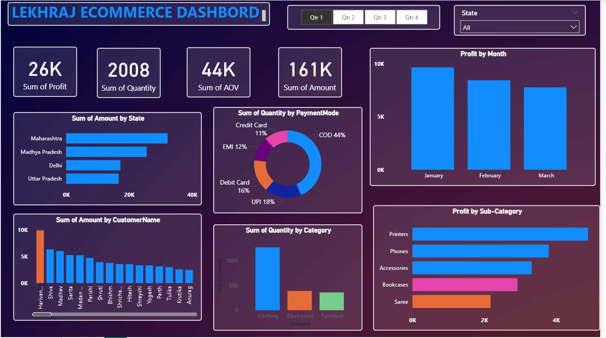

# E-commerce Power BI Dashboard

This is a Power BI dashboard for analyzing e-commerce sales data. It includes visualizations such as sales trends, customer insights, product performance, and more.

## Features
- Interactive charts and filters
- Sales forecasting
- Customer segmentation
- KPIs and performance tracking

## How to Use
1. Download the `ecommerce_dashboard.pbix` file.
2. Open it with Power BI Desktop.
3. Load the provided data files or connect to your own datasets.

## Screenshot

> *Note: The screenshot file is uploaded directly in the repository’s root folder.*

## Contact
Connect with me on [LinkedIn](https://www.linkedin.com/in/lekhraj-prajapati-15aa26273).
